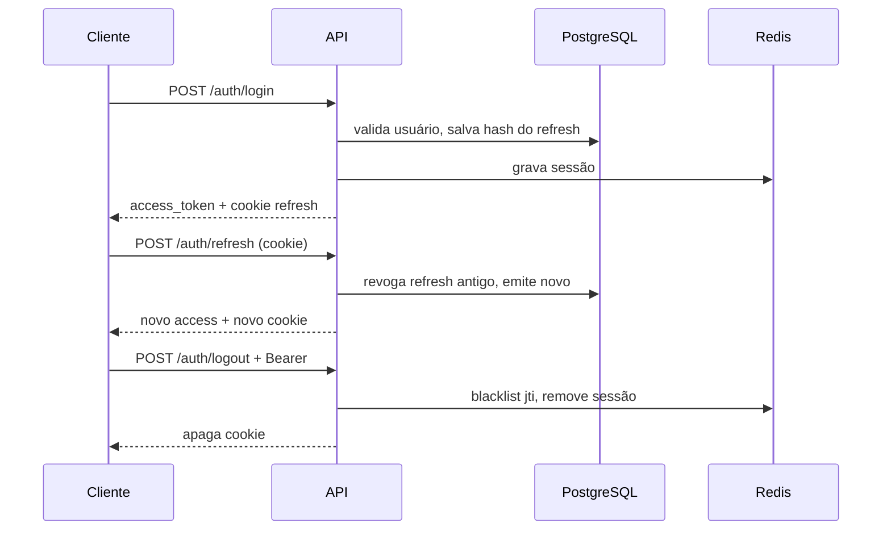

# Auth Service

API de autenticação em Go para portfólio — registro, login, JWT, refresh em cookie HttpOnly, RBAC e auditoria.

**Stack:** Go 1.25 · chi · PostgreSQL · Redis · JWT · bcrypt · Prometheus

---

## Início rápido

```bash
cp .env.example .env          # ajuste AUTH_HTTP_PORT se precisar (ex.: 8081)
docker compose up -d postgres redis migrate
make run
```

| Recurso | URL |
|---------|-----|
| API | `http://localhost:8081/api/v1` |
| Docs (Redoc) | `http://localhost:8081/docs` |
| OpenAPI | `http://localhost:8081/openapi.yaml` |
| Health | `http://localhost:8081/health` |

> **Docker parado?** O `make run` local precisa do Postgres e Redis. Suba com o comando acima antes de rodar a API.

**Tudo no Docker** (API incluída):

```bash
docker compose up -d --build
```

---

## O que o projeto faz

- Registro de usuário com role `user` e verificação de email
- Login com **access token** (JSON) + **refresh token** (cookie HttpOnly)
- Rotação de refresh, logout, revogação de sessões
- Reset de senha e verificação de email via **[Resend](https://resend.com)** (opcional) ou tokens na API em dev
- Perfil autenticado (`/me`) com RBAC
- Rate limit, lockout de login, blacklist de JWT e auditoria

---

## Fluxo de autenticação



---

## Estrutura do código

```
cmd/api/              → main
internal/
  delivery/http/      → router, handlers, middleware  (HTTP)
  usecase/            → auth.go (fluxos) + internal.go (tokens, email, audit)
  domain/             → entidades + interfaces (ports)
  repository/postgres → SQL
  infrastructure/     → redis, jwt, postgres pool
  app/                → wiring / bootstrap
pkg/                  → httputil, password, validate
```

**Fluxo:** `HTTP handler` → `usecase` → `domain interface` → `postgres` ou `redis`

---

## API (`/api/v1`)

### Auth pública

| Método | Rota | Descrição |
|--------|------|-----------|
| POST | `/auth/register` | Cria usuário. Header opcional: `Idempotency-Key` |
| POST | `/auth/login` | Retorna `access_token`; refresh vai para cookie |
| POST | `/auth/refresh` | Renova tokens (envia cookie) |
| POST | `/auth/forgot-password` | Solicita reset (não revela se email existe) |
| POST | `/auth/reset-password` | Define nova senha |
| POST | `/auth/verify-email` | Confirma email |

### Auth protegida (Bearer JWT)

| Método | Rota | Descrição |
|--------|------|-----------|
| POST | `/auth/logout` | Encerra sessão atual |
| POST | `/auth/logout-all` | Revoga todas as sessões |
| GET | `/me` | Perfil + roles (requer permissão `read_profile`) |

### Ops

| Método | Rota | Descrição |
|--------|------|-----------|
| GET | `/health` | Liveness |
| GET | `/ready` | Readiness (Postgres + Redis) |

Documentação completa: [`docs/openapi.yaml`](docs/openapi.yaml) · Postman: [`docs/postman_collection.json`](docs/postman_collection.json)

---

## Testar manualmente

```bash
BASE=http://localhost:8081

# 1. Registrar
curl -s -X POST "$BASE/api/v1/auth/register" \
  -H "Content-Type: application/json" \
  -d '{"email":"user@example.com","password":"securepass123"}'

# 2. Login (salva cookie)
curl -s -c cookies.txt -X POST "$BASE/api/v1/auth/login" \
  -H "Content-Type: application/json" \
  -d '{"email":"user@example.com","password":"securepass123"}'

# 3. Perfil (copie access_token do passo 2)
curl -s "$BASE/api/v1/me" -H "Authorization: Bearer <access_token>"

# 4. Refresh
curl -s -b cookies.txt -c cookies.txt -X POST "$BASE/api/v1/auth/refresh"
```

**Testes automatizados:**

```bash
make test       # unitários (não precisa de gcc)
make test-race  # ou: make race — requer gcc (build-essential)
make test-e2e   # API rodando (usa porta do .env)
```

> `make race` usa o detector de race do Go, que exige **CGO + gcc**. No Ubuntu/Debian:
> `sudo apt-get update && sudo apt-get install -y build-essential`

---

## Segurança

| Mecanismo | Comportamento |
|-----------|---------------|
| Senhas | bcrypt (cost configurável) |
| Access JWT | Curto (~15 min), com `jti`, roles e permissions |
| Refresh | Opaco, hash no Postgres, cookie HttpOnly, rotação |
| Replay | Reuso de refresh revogado → revoga família inteira |
| Lockout | 5 falhas de login → bloqueio temporário (`account_locked`, 429) |
| Rate limit | Por IP no Redis — global + por rota |
| Injection | SQL parametrizado (pgx); links de e-mail via `url.Parse` (http/https); HTML escapado; tokens 64 hex; entradas com `safe_text` / `safe_password` (sem execução de shell — o serviço não chama `os/exec`) |

**Limites padrão (req/min por IP):**

| Escopo | Variável de ambiente | Default |
|--------|---------------------|---------|
| Global `/api/v1` | `AUTH_SECURITY_RATE_LIMIT_RPM` | 120 |
| Login | `AUTH_SECURITY_LOGIN_RATE_LIMIT_RPM` | 10 |
| Register | `AUTH_SECURITY_REGISTER_RATE_LIMIT_RPM` | 30 |
| Refresh | `AUTH_SECURITY_REFRESH_RATE_LIMIT_RPM` | 20 |
| Forgot / reset / verify | `AUTH_SECURITY_SENSITIVE_RATE_LIMIT_RPM` | 5 |

Erros padronizados: `{ "code", "message", "details?" }`. Em rate limit: HTTP 429 + `Retry-After`.

---

## E-mail (Resend)

Com `AUTH_EMAIL_ENABLED=false` (padrão), os tokens de verificação/reset aparecem na resposta JSON para testes locais.

Para enviar de verdade:

1. Crie conta em [resend.com](https://resend.com) e gere uma API key.
2. Verifique um domínio (ou use `onboarding@resend.dev` só para testes).
3. No `.env`:

```env
AUTH_EMAIL_ENABLED=true
AUTH_EMAIL_API_KEY=re_...
AUTH_EMAIL_FROM="Auth <onboarding@resend.dev>"
AUTH_EMAIL_VERIFY_LINK_BASE=http://localhost:3000/verify-email
AUTH_EMAIL_RESET_LINK_BASE=http://localhost:3000/reset-password
```

O front deve ler `?token=` na URL e chamar `POST /api/v1/auth/verify-email` ou `reset-password`.

**Limite anti-abuso:** até `AUTH_EMAIL_PER_RECIPIENT_LIMIT` (default 5) e-mails por destinatário a cada `AUTH_EMAIL_PER_RECIPIENT_WINDOW` (default 1h), via Redis. No registro, estouro retorna `429 rate_limited`; no forgot-password a API responde igual, sem enviar.

Em produção com e-mail ativo, os tokens **não** vão mais no JSON da API.

---

## Configuração

Todas as variáveis usam prefixo `AUTH_`. Copie [`.env.example`](.env.example).

Obrigatório em produção (validado no boot):
- `AUTH_JWT_ACCESS_SECRET` com **≥ 32 caracteres**
- `AUTH_APP_ENVIRONMENT=production`
- `AUTH_JWT_REFRESH_COOKIE_SECURE=true`
- `AUTH_HTTP_ALLOWED_ORIGINS` explícito (sem `*` — cookies com credenciais)
- Postgres com SSL (`AUTH_POSTGRES_SSLMODE` ≠ `disable`)
- Atrás de proxy reverso: `AUTH_HTTP_TRUST_PROXY=true` (habilita RealIP; sem isso o IP vem só de `RemoteAddr`)

---

## RBAC (seed)

| Role | Permissões |
|------|------------|
| admin | todas |
| moderator | read/update profile, moderate_content |
| user | read/update profile |

---

## CI

Lint, testes, build e `govulncheck` via GitHub Actions (`.github/workflows`).
